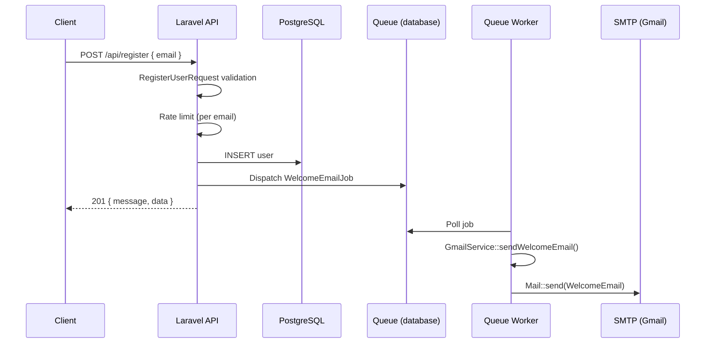
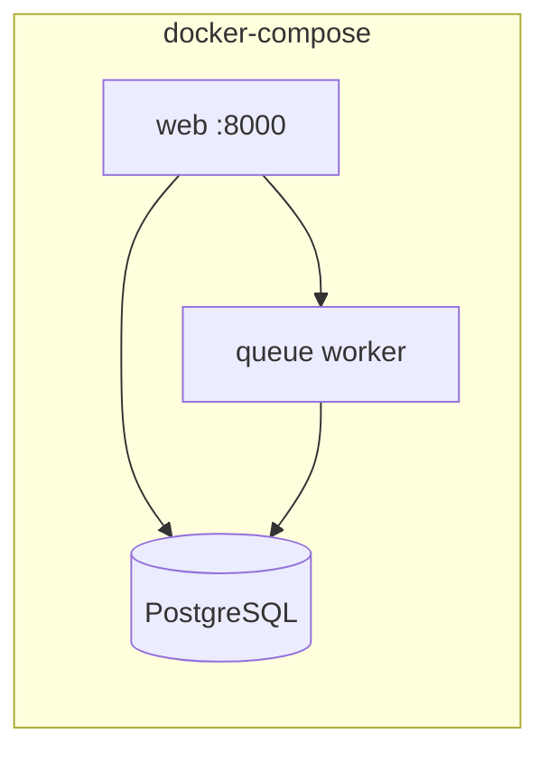

# Architecture

## Overview

This API accepts an email address, persists it to PostgreSQL, and dispatches a queued job to send a welcome email over SMTP.

## Request Flow

## Components

| Layer | Class | Responsibility |
|-------|-------|----------------|
| HTTP | `RegisterUserRequest` | Validates email (required, format, unique) |
| HTTP | `UserController` | Creates user, dispatches job, returns JSON |
| Job | `WelcomeEmailJob` | Async wrapper for email sending |
| Service | `GmailService` | Sends `WelcomeEmail` mailable via `Mail` facade |
| Mail | `WelcomeEmail` | Blade template for welcome message |

## Docker Topology

- **web**: Runs `php artisan serve`, executes migrations on startup.
- **queue**: Runs `php artisan queue:work` for `WelcomeEmailJob`.
- **db**: PostgreSQL with health checks; `web` and `queue` wait until ready.

## Error Handling

- Validation errors return `422` with field-level `errors` (no stack traces).
- Unexpected API errors return a generic `500` message when `APP_DEBUG=false`.
- Email failures are logged; the job can be retried by the queue worker.

## Rate Limiting

`POST /api/register` is limited to **5 requests per minute per email address** (falls back to IP when email is absent).
